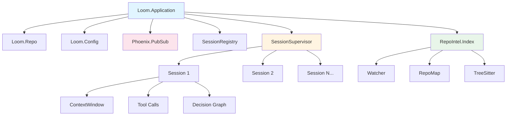
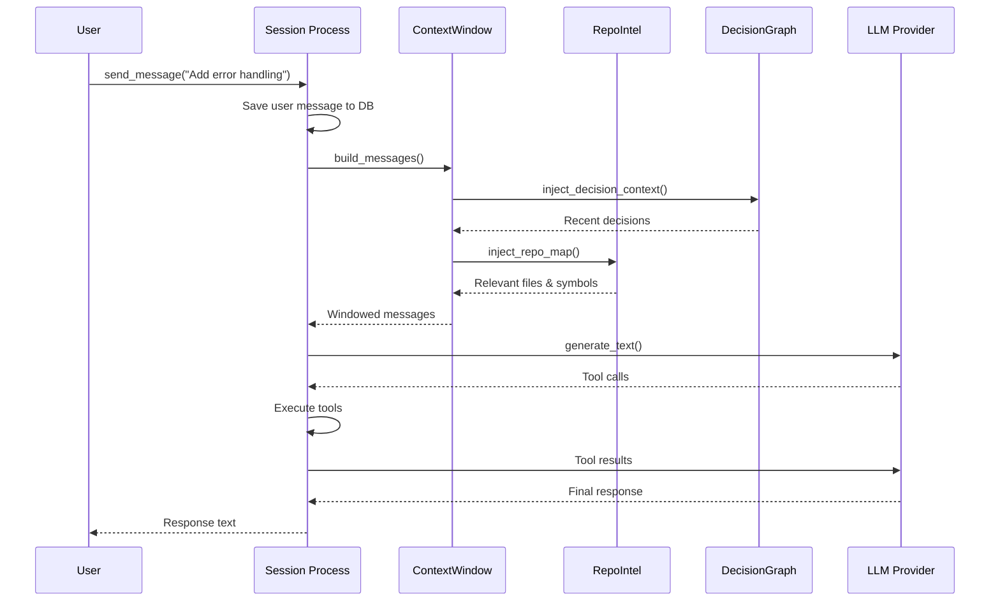

## Overview

Loom is built as an **Elixir OTP application** with a modular, supervised architecture. Each component runs as a process under a supervision tree, ensuring fault tolerance and isolated state management.

## System Components

The application initializes the following core components in order:

### Storage Layer
```elixir
Loom.Repo
```
PostgreSQL database connection via Ecto. Stores sessions, messages, decision graphs, and permission grants.

### Configuration
```elixir
Loom.Config
```
ETS-based configuration store. Provides fast, in-memory access to runtime settings across the application.

### Event Broadcasting
```elixir
{Phoenix.PubSub, name: Loom.PubSub}
```
PubSub system for real-time session events. Powers live UI updates and cross-process communication.

**Topics:**
- `session:#{session_id}` - Session-specific events (messages, tool execution, status changes)
- `repo:updates` - Repository file change notifications

### Session Registry
```elixir
{Registry, keys: :unique, name: Loom.SessionRegistry}
```
Maps session IDs to process PIDs. Enables fast session lookup and metadata tracking (current status: `:idle`, `:thinking`, `:executing_tool`).

### LSP Server Management
```elixir
Loom.LSP.Supervisor
```
Manages Language Server Protocol connections for enhanced code intelligence.

### Repository Intelligence
```elixir
Loom.RepoIntel.Index
```
ETS-based file index. Scans and tracks repository structure, file metadata, and language detection.

**See:** [Repo Intelligence](/concepts/repo-intelligence)

### Session Management
```elixir
{DynamicSupervisor, name: Loom.SessionSupervisor}
```
Dynamically spawns and supervises session processes. Each coding session runs as an isolated GenServer.

**See:** [Sessions](/concepts/sessions)

### Optional Services

Loom conditionally starts services based on configuration:

- **File Watcher** (`Loom.RepoIntel.Watcher`) - OS-level file change monitoring with `.gitignore` support
- **MCP Server** - Model Context Protocol server for external tool integrations
- **MCP Clients** - Connections to external MCP servers
- **Web Endpoint** (`LoomWeb.Endpoint`) - Phoenix LiveView interface

## Architecture Diagram



## Process Supervision Strategy

Loom uses a **one-for-one** supervision strategy:

```elixir
opts = [strategy: :one_for_one, name: Loom.Supervisor]
Supervisor.start_link(children, opts)
```

**What this means:**
- If a session crashes, only that session restarts
- Other sessions continue running unaffected
- The repo index and config remain stable
- The system maintains high availability

<Info>
**Fault Isolation**: Each session runs in its own process. A crash in Session A (e.g., a buggy tool execution) won't impact Session B.
</Info>

## Startup Flow

<Steps>
  <Step title="Database Migration">
    In release mode, Loom automatically runs migrations via `Loom.Release.migrate()`
  </Step>
  
  <Step title="Symbol Cache Initialization">
    Tree-sitter symbol cache is initialized: `Loom.RepoIntel.TreeSitter.init_cache()`
  </Step>
  
  <Step title="Core Services Start">
    Database, config, PubSub, registry, and index processes start under supervision
  </Step>
  
  <Step title="Optional Services">
    File watcher, MCP server/clients, and web endpoint start based on configuration
  </Step>
</Steps>

## Data Flow Example

Here's how a typical user message flows through the system:



## Configuration System

Loom uses a hybrid configuration approach:

### Compile-Time Config
**File:** `config/config.exs`, `config/runtime.exs`

```elixir
config :loom,
  default_model: "anthropic:claude-sonnet-4-6",
  ecto_repos: [Loom.Repo]
```

### Runtime Config
**Module:** `Loom.Config`

Stored in ETS for fast access across processes:

```elixir
Loom.Config.get(:model, :architect)
# => "anthropic:claude-opus-4-6"

Loom.Config.get(:repo, :watch_enabled)
# => true
```

## State Management

Loom maintains state across several layers:

| Layer | Storage | Persistence | Use Case |
|-------|---------|-------------|-----------|
| **Session State** | GenServer state | Temporary | Active conversation, pending tool calls |
| **Database** | PostgreSQL | Permanent | Sessions, messages, decision nodes |
| **ETS Tables** | In-memory | Temporary | File index, symbol cache, config |
| **Registry** | Registry | Temporary | Session PID lookup, status metadata |

<Note>
Session state is **not persisted** between restarts. Only the message history and decision graph are saved to the database. When a session is resumed, it rebuilds its in-memory state from persisted data.
</Note>

## Extension Points

Loom's architecture supports extension through:

1. **Tools** - Add new capabilities via Jido Actions
2. **MCP Servers** - Connect external tools and data sources
3. **Decision Graph Nodes** - Custom node types for domain-specific workflows
4. **RepoIntel Extractors** - New language support for symbol extraction

## Performance Characteristics

### Concurrency
- **Multiple sessions run in parallel** - Each session is a separate Erlang process
- **Tool execution is synchronous** within a session - Tools execute one at a time per session
- **File index operations are concurrent** - Multiple sessions can read the index simultaneously (ETS read concurrency)

### Memory Management
- **Context window pruning** - Old messages are automatically trimmed to fit model limits
- **Symbol cache** - Tree-sitter results are cached by file mtime
- **Repo map generation** - Ranked and budgeted to stay within token limits

### Scalability
Loom is designed for **single-user, multi-session** workflows:
- ✅ Run 10s of concurrent sessions on a laptop
- ✅ Handle large repositories (100k+ files) via incremental indexing
- ⚠️  Not designed for multi-tenant SaaS (no auth, isolation, or rate limiting)

## Next Steps

<CardGroup cols={2}>
  <Card title="Sessions" icon="comments" href="/concepts/sessions">
    Learn how sessions manage the agent loop
  </Card>
  <Card title="Decision Graphs" icon="diagram-project" href="/concepts/decision-graphs">
    Understand how decisions are tracked and injected
  </Card>
  <Card title="Repo Intelligence" icon="magnifying-glass-chart" href="/concepts/repo-intelligence">
    Explore file indexing and symbol extraction
  </Card>
  <Card title="Context Window" icon="window-maximize" href="/concepts/context-window">
    See how context is budgeted and managed
  </Card>
</CardGroup>