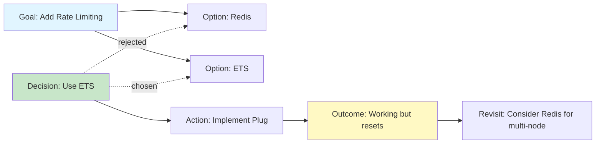

## What Are Decision Graphs?

Decision graphs capture the **reasoning behind code changes** as a structured, queryable graph. Instead of just storing "what changed," Loom tracks:

- **Goals** - What you're trying to achieve
- **Decisions** - Choices made during development
- **Options** - Alternatives considered
- **Actions** - Concrete steps taken
- **Outcomes** - Results and observations

This creates a **knowledge graph of your development process** that Loom can reference in future conversations.

## Node Types

Decision graphs consist of typed nodes connected by edges:

### Node Types

| Type | Purpose | Example |
|------|---------|--------|
| `goal` | High-level objective | "Add authentication to the API" |
| `decision` | A choice that was made | "Use JWT tokens instead of sessions" |
| `option` | Alternative considered | "Considered OAuth2 but too complex for v1" |
| `action` | Concrete task or change | "Implement JWT middleware" |
| `outcome` | Result of an action | "Auth working but token refresh needed" |
| `observation` | Learning or insight | "Token expiry should be configurable" |
| `revisit` | Decision to reconsider | "Revisit OAuth2 for v2 with SSO support" |

### Edge Types

Edges define relationships between nodes:

| Type | Meaning | Example |
|------|---------|--------|
| `leads_to` | Causal relationship | Goal → Action |
| `chosen` | Selected option | Decision → Option |
| `rejected` | Dismissed option | Decision → Option (rejected) |
| `requires` | Dependency | Action → Action |
| `blocks` | Blocker | Issue → Action |
| `enables` | Enabler | Action → Goal |
| `supersedes` | Replacement | New Decision → Old Decision |

## Data Model

### DecisionNode Schema

```elixir
schema "decision_nodes" do
  field :node_type, Ecto.Enum,
    values: [:goal, :decision, :option, :action, :outcome, :observation, :revisit]

  field :title, :string              # Short summary
  field :description, :string        # Detailed explanation
  field :status, Ecto.Enum,          # :active, :superseded, :abandoned
    default: :active
  field :confidence, :integer        # 0-100 confidence level
  field :metadata, :map              # Arbitrary key-value data

  belongs_to :session, Session       # Optional session association

  timestamps()
end
```

### DecisionEdge Schema

```elixir
schema "decision_edges" do
  belongs_to :from_node, DecisionNode
  belongs_to :to_node, DecisionNode

  field :edge_type, Ecto.Enum,
    values: [:leads_to, :chosen, :rejected, :requires, :blocks, :enables, :supersedes]

  field :weight, :float, default: 1.0  # Edge strength/importance
  field :rationale, :string            # Why this relationship exists

  timestamps()
end
```

## Core API

The `Loom.Decisions.Graph` module provides the primary API:

### Creating Nodes

```elixir
Loom.Decisions.Graph.add_node(%{
  node_type: :goal,
  title: "Improve error handling",
  description: "Add structured error types and better logging",
  status: :active,
  confidence: 85,
  session_id: session_id
})
```

### Creating Edges

```elixir
{:ok, goal} = Graph.add_node(%{node_type: :goal, title: "Add caching"})
{:ok, action} = Graph.add_node(%{node_type: :action, title: "Implement Redis cache"})

Graph.add_edge(goal.id, action.id, :leads_to, 
  rationale: "Redis chosen for distributed caching support"
)
```

### Querying

```elixir
# Get all active goals
Graph.active_goals()

# Get recent decisions
Graph.recent_decisions(limit: 10)

# Filter by session
Graph.list_nodes(session_id: "abc-123", node_type: :decision)

# Get edges from a node
Graph.list_edges(from_node_id: goal.id)
```

### Superseding Decisions

```elixir
# Mark an old decision as superseded
Graph.supersede(old_decision_id, new_decision_id, 
  rationale: "Performance benchmarks showed approach B is 3x faster"
)
```

This automatically:
1. Creates a `:supersedes` edge
2. Updates the old node's status to `:superseded`
3. Wraps both operations in a transaction

## Context Injection

Decision graphs are automatically injected into the system prompt via the **ContextWindow**.

### How It Works

```elixir
# In Loom.Session.ContextWindow
defp inject_decision_context(system_parts, session_id) do
  case Loom.Decisions.ContextBuilder.build(session_id) do
    {:ok, context} when is_binary(context) and context != "" ->
      system_parts ++ [context]
    _ ->
      system_parts
  end
end
```

### Context Format

The injected context is structured markdown:

```markdown
## Active Goals
- Add authentication to the API (confidence: 85%)
- Improve error handling (confidence: 90%)

## Recent Decisions
- [decision] Use JWT tokens for auth
- [option] Considered OAuth2 but too complex
- [action] Implement JWT middleware

## Session Context
[2026-02-28 10:30] goal: Add authentication to the API
  JWT-based auth with refresh tokens
[2026-02-28 10:35] decision: Use JWT tokens for auth
  (confidence: 85%)
[2026-02-28 10:40] action: Implement JWT middleware
```

### Token Budget

Decision context is allocated a fixed token budget (default: **1024 tokens**):

```elixir
@zone_defaults %{
  decision_context: 1024,  # Decision graph budget
  repo_map: 2048,          # Repo map budget
  system_prompt: 2048,     # Base system prompt
  tool_definitions: 2048,  # Tool schemas
  reserved_output: 4096    # Output buffer
}
```

If the context exceeds the budget, it's truncated with `[truncated...]`.

## Narrative Timelines

The `Loom.Decisions.Narrative` module builds chronological views:

### Session Timeline

```elixir
Narrative.for_session(session_id)
|> Narrative.format_timeline()
```

**Output:**
```
[2026-02-28 10:30] goal: Add authentication to the API
  JWT-based auth with refresh tokens
[2026-02-28 10:35] decision: Use JWT tokens for auth [active] (confidence: 85%)
[2026-02-28 10:40] action: Implement JWT middleware
[2026-02-28 11:00] outcome: Auth working but token refresh needed
```

### Goal Timeline

```elixir
Narrative.for_goal(goal_id)
```

Returns all nodes connected to a goal (breadth-first traversal) sorted chronologically.

## Pulse Reports

The `Loom.Decisions.Pulse` module generates health reports:

```elixir
Pulse.generate()
# => %{
#   active_goals: [...],
#   recent_decisions: [...],
#   coverage_gaps: [...],     # Goals with no actions/outcomes
#   low_confidence: [...],    # Nodes with confidence < 50%
#   stale_nodes: [...],       # Nodes unchanged for 7+ days
#   summary: "Pulse: 3 active goal(s), 5 recent decision(s), ..."
# }
```

### Coverage Gaps

Identifies goals that lack concrete actions or outcomes:

```elixir
defp find_coverage_gaps(goals) do
  Enum.filter(goals, fn goal ->
    connected_types = # ... get connected node types
    not Enum.any?(connected_types, &(&1 in [:action, :outcome]))
  end)
end
```

<Warning>
A goal with no actions or outcomes might indicate:
- Planning paralysis
- Forgotten goal
- Need for decomposition
</Warning>

### Stale Nodes

Finds active nodes unchanged for 7+ days (configurable):

```elixir
Pulse.generate(stale_days: 14)
```

## Example Workflow

Here's how a decision graph might evolve during development:

<Steps>
  <Step title="User sets a goal">
    ```elixir
    {:ok, goal} = Graph.add_node(%{
      node_type: :goal,
      title: "Add rate limiting to API",
      confidence: 70
    })
    ```
  </Step>

  <Step title="AI proposes options">
    ```elixir
    {:ok, opt1} = Graph.add_node(%{
      node_type: :option,
      title: "Use Redis for rate limit tracking"
    })
    {:ok, opt2} = Graph.add_node(%{
      node_type: :option,
      title: "Use ETS for in-memory tracking"
    })
    
    Graph.add_edge(goal.id, opt1.id, :leads_to)
    Graph.add_edge(goal.id, opt2.id, :leads_to)
    ```
  </Step>

  <Step title="Decision is made">
    ```elixir
    {:ok, decision} = Graph.add_node(%{
      node_type: :decision,
      title: "Use ETS for rate limiting",
      confidence: 85,
      description: "Redis adds external dependency; ETS is simpler for single-node deployment"
    })
    
    Graph.add_edge(decision.id, opt2.id, :chosen)
    Graph.add_edge(decision.id, opt1.id, :rejected,
      rationale: "Avoiding Redis dependency for MVP"
    )
    ```
  </Step>

  <Step title="Actions are taken">
    ```elixir
    {:ok, action} = Graph.add_node(%{
      node_type: :action,
      title: "Implement ETS-based rate limiter plug"
    })
    
    Graph.add_edge(decision.id, action.id, :leads_to)
    ```
  </Step>

  <Step title="Outcome is recorded">
    ```elixir
    {:ok, outcome} = Graph.add_node(%{
      node_type: :outcome,
      title: "Rate limiter working but resets on server restart",
      confidence: 60
    })
    
    Graph.add_edge(action.id, outcome.id, :leads_to)
    ```
  </Step>

  <Step title="Future revisit is noted">
    ```elixir
    {:ok, revisit} = Graph.add_node(%{
      node_type: :revisit,
      title: "Consider Redis for distributed rate limiting",
      description: "When we deploy multiple instances"
    })
    
    Graph.add_edge(outcome.id, revisit.id, :enables)
    ```
  </Step>
</Steps>

## Visualization

Decision graphs can be visualized using tools like:

- **Mermaid.js** - Render graphs in documentation
- **Graphviz** - Generate PNG/SVG diagrams
- **Neo4j** - Import for advanced graph queries (future)

### Mermaid Example



## Best Practices

<AccordionGroup>
  <Accordion title="Keep titles concise">
    Use 5-10 words for node titles. Put details in the `description` field.
    
    ✅ **Good:** "Use JWT tokens for auth"
    
    ❌ **Bad:** "After evaluating several authentication approaches including session-based auth, OAuth2, and JWT tokens, we decided to..."
  </Accordion>

  <Accordion title="Use confidence scores">
    Track uncertainty with the `confidence` field (0-100).
    
    - **90-100%** - Very confident, well-researched
    - **70-89%** - Confident, but some unknowns
    - **50-69%** - Moderate confidence, needs validation
    - **Below 50%** - Low confidence, experimental
  </Accordion>

  <Accordion title="Record rejected options">
    Document **why** options were rejected. This prevents re-exploring dead ends.
    
    ```elixir
    Graph.add_edge(decision.id, rejected_option.id, :rejected,
      rationale: "Benchmarks showed 40% slower performance"
    )
    ```
  </Accordion>

  <Accordion title="Link decisions to sessions">
    Associate decisions with the session where they were made:
    
    ```elixir
    Graph.add_node(%{
      node_type: :decision,
      title: "Refactor UserController",
      session_id: current_session_id
    })
    ```
    
    This enables session-scoped queries and context injection.
  </Accordion>

  <Accordion title="Use metadata for extensibility">
    Store arbitrary data in the `metadata` field:
    
    ```elixir
    Graph.add_node(%{
      node_type: :outcome,
      title: "Performance improved",
      metadata: %{
        before_ms: 450,
        after_ms: 120,
        benchmark_url: "https://..."
      }
    })
    ```
  </Accordion>
</AccordionGroup>

## Future Enhancements

- **Automatic extraction** - Parse decisions from commit messages
- **Similarity search** - Find related past decisions using embeddings
- **Decision templates** - Pre-structured patterns (e.g., "API design decision")
- **Export/import** - Share decision graphs across projects
- **Analytics** - Track decision quality, confidence trends, outcome success rates

## Next Steps

<CardGroup cols={2}>
  <Card title="Architecture" icon="sitemap" href="/concepts/architecture">
    Understand where decision graphs fit in the system
  </Card>
  <Card title="Context Window" icon="window-maximize" href="/concepts/context-window">
    Learn how decisions are injected into prompts
  </Card>
</CardGroup>