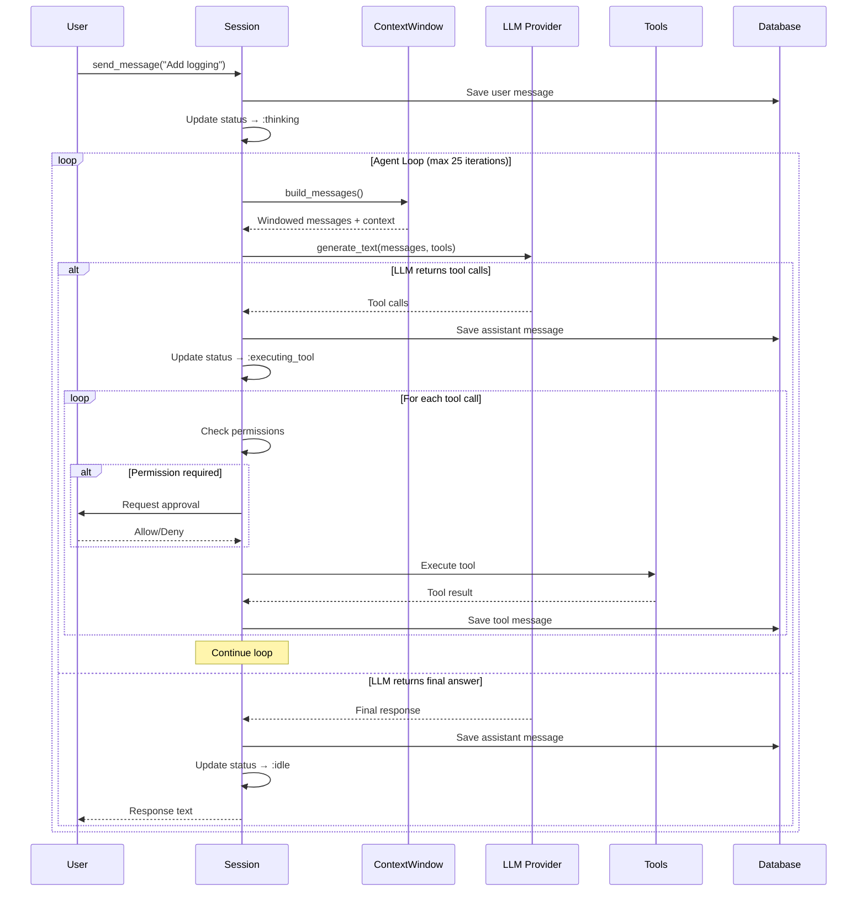

## What is a Session?

A **session** is an isolated conversation between you and Loom. Each session:

- Runs as a **separate Erlang process** (GenServer)
- Has its own **message history** and **context window**
- Can use a **different AI model**
- Is tied to a **specific project directory**
- Maintains **state** (status, pending tool calls, permissions)

Sessions are supervised by `Loom.SessionSupervisor` and registered in `Loom.SessionRegistry` for fast lookup.

## Session Lifecycle

### Creating a Session

```elixir
Loom.Session.Manager.start_session(
  session_id: "my-session",           # Optional: auto-generated if omitted
  model: "anthropic:claude-sonnet-4-6",
  project_path: "/path/to/project",
  title: "Add authentication",
  tools: [FileRead, FileEdit, BashExec],
  auto_approve: false                 # Require user approval for tools
)
# => {:ok, #PID<0.234.0>}
```

### Session Modes

Loom supports two execution modes:

#### Normal Mode (Default)

Standard agent loop with a single model:

1. User sends message
2. LLM responds with tool calls or final answer
3. Tools execute (with permission checks)
4. Results feed back to LLM
5. Loop continues until final answer

#### Architect Mode

Two-model workflow inspired by [Aider's architect mode](https://aider.chat/):

1. **Architect** (strong model) - Plans changes with full context
2. **Editor** (fast model) - Executes the plan step-by-step

**Switch modes:**

```elixir
Loom.Session.set_mode(session_id, :architect)
Loom.Session.set_mode(session_id, :normal)
```

**See:** [Architect Mode](#architect-mode) below for details.

### Finding a Session

```elixir
# By ID
{:ok, pid} = Loom.Session.Manager.find_session("my-session")

# List all active sessions
Loom.Session.Manager.list_active()
# => [
#   %{id: "session-1", pid: #PID<0.234.0>, status: :idle},
#   %{id: "session-2", pid: #PID<0.235.0>, status: :thinking}
# ]
```

### Stopping a Session

```elixir
Loom.Session.Manager.stop_session("my-session")
# => :ok
```

<Warning>
Stopping a session **does not** delete the database records. The message history and decision graph are preserved and can be resumed later.
</Warning>

## Session State

Each session maintains state in its GenServer:

```elixir
defstruct [
  :id,                   # Session UUID
  :model,                # Current model (e.g., "anthropic:claude-sonnet-4-6")
  :project_path,         # Project directory
  :db_session,           # Database record (Loom.Schemas.Session)
  :status,               # :idle | :thinking | :executing_tool
  messages: [],          # In-memory message history
  tools: [],             # Available tools (Jido Actions)
  auto_approve: false,   # Skip permission prompts?
  pending_permission: nil, # Pending tool waiting for approval
  mode: :normal          # :normal | :architect
]
```

### Session Status

Status is tracked in both:
1. **GenServer state** - For the current process
2. **Registry metadata** - For cross-process queries

```elixir
Loom.Session.get_status(session_id)
# => {:ok, :thinking}
```

**Possible values:**
- `:idle` - Waiting for user input
- `:thinking` - LLM is processing
- `:executing_tool` - Running a tool

## The Agent Loop

Here's how Loom processes a user message in **normal mode**:



### Iteration Limit

The agent loop stops after **25 iterations** to prevent runaway costs:

```elixir
@max_tool_iterations 25

defp agent_loop(state, iteration) when iteration >= @max_tool_iterations do
  error_msg = "Maximum tool call iterations (#{@max_tool_iterations}) exceeded."
  {:error, error_msg, state}
end
```

<Info>
Most tasks complete in **3-10 iterations**. If you hit the limit, the task is likely too complex or the AI is stuck in a loop.
</Info>

## Message Persistence

All messages are saved to the database:

```elixir
defmodule Loom.Schemas.Message do
  schema "messages" do
    field :role, Ecto.Enum, values: [:user, :assistant, :tool, :system]
    field :content, :string
    field :tool_calls, {:array, :map}     # For assistant messages with tools
    field :tool_call_id, :string          # For tool messages
    
    belongs_to :session, Loom.Schemas.Session
    
    timestamps()
  end
end
```

### Message Roles

| Role | Purpose | Example |
|------|---------|--------|
| `:user` | User input | "Add error handling to session.ex" |
| `:assistant` | AI response | "I'll add try/rescue blocks..." |
| `:tool` | Tool result | "File edited: 3 changes made" |
| `:system` | System prompt | "You are Loom, an AI coding assistant..." |

### Resuming Sessions

When a session is resumed, messages are loaded from the database:

```elixir
defp load_or_create_session(session_id, model, project_path, title) do
  case Persistence.get_session(session_id) do
    nil ->
      # Create new session
      Persistence.create_session(%{id: session_id, model: model, ...})
      {:ok, db_session, []}
    
    db_session ->
      # Resume existing session
      messages = Persistence.load_messages(session_id)
      {:ok, db_session, messages}
  end
end
```

## Permission System

Loom requires **user approval** for potentially dangerous tools unless `auto_approve: true`.

### Permission Flow

<Steps>
  <Step title="AI calls a tool">
    ```json
    {"name": "file_edit", "arguments": {"file_path": "lib/session.ex"}}
    ```
  </Step>

  <Step title="Session checks permissions">
    ```elixir
    case Loom.Permissions.Manager.check("file_edit", "lib/session.ex", session_id) do
      :allowed -> # Execute immediately
      :ask -> # Broadcast permission request
    end
    ```
  </Step>

  <Step title="User responds">
    ```elixir
    Loom.Session.respond_to_permission(session_id, "allow_once")
    # or
    Loom.Session.respond_to_permission(session_id, "allow_always")
    # or
    Loom.Session.respond_to_permission(session_id, "deny")
    ```
  </Step>

  <Step title="Tool executes or errors">
    - **allow_once** - Execute this time only
    - **allow_always** - Grant permanent permission for this tool + path
    - **deny** - Return error to AI
  </Step>
</Steps>

### Pending Permission State

When waiting for permission, the session stores:

```elixir
pending_permission: %{
  tool_call: %{name: "file_edit", arguments: %{...}},
  tool_module: FileEdit,
  tool_name: "file_edit",
  tool_path: "lib/session.ex",
  tool_call_id: "call_123",
  remaining_tool_calls: [...],  # Other tools in the batch
  from: {pid, ref},             # GenServer caller
  response: %ReqLLM.Response{}, # LLM response
  iteration: 3                  # Current agent loop iteration
}
```

The session **pauses** the agent loop until the user responds.

## Architect Mode

Inspired by **Aider's architect mode**, this workflow uses two models:

### How It Works

<Steps>
  <Step title="User sends request">
    "Add rate limiting to the API"
  </Step>

  <Step title="Architect phase">
    **Strong model** (e.g., Claude Opus) receives:
    - Full repo map
    - Decision graph context
    - Conversation history
    - User request
    
    Produces a **structured JSON plan**:
    ```json
    {
      "summary": "Add ETS-based rate limiter plug",
      "plan": [
        {
          "file": "lib/loom_web/plugs/rate_limiter.ex",
          "action": "create",
          "description": "Create rate limiter plug module",
          "details": "defmodule LoomWeb.Plugs.RateLimiter do...\n..."
        },
        {
          "file": "lib/loom_web/endpoint.ex",
          "action": "edit",
          "description": "Add rate limiter to endpoint",
          "details": "Add `plug LoomWeb.Plugs.RateLimiter` after line 15"
        }
      ]
    }
    ```
  </Step>

  <Step title="Editor phase">
    **Fast model** (e.g., Claude Haiku) executes each plan step:
    
    For each step:
    1. Receives focused prompt with **only** the target file and edit instructions
    2. Uses `file_read`, `file_edit`, `file_write` tools
    3. Reports results
    
    The editor has **no** conversation history or repo map—just the specific task.
  </Step>

  <Step title="Results aggregated">
    ```markdown
    ## Execution Complete
    
    Add ETS-based rate limiter plug
    
    ### Results (2/2 succeeded):
    1. [OK] create `lib/loom_web/plugs/rate_limiter.ex` — Created with 45 lines
    2. [OK] edit `lib/loom_web/endpoint.ex` — Added plug at line 16
    ```
  </Step>
</Steps>

### Why Two Models?

| Aspect | Architect (Strong) | Editor (Fast) |
|--------|-------------------|---------------|
| **Context** | Full repo, decisions, history | Specific file + instructions |
| **Task** | Strategic planning | Tactical execution |
| **Cost** | High (large context) | Low (focused context) |
| **Latency** | Slower | Faster |
| **Example** | Claude Opus 4-6 | Claude Haiku 4-5 |

**Result:** Better plans + faster execution + lower cost.

### Configure Architect Models

```elixir
# In config/config.exs
config :loom, :model,
  architect: "anthropic:claude-opus-4-6",
  editor: "anthropic:claude-haiku-4-5"

# Or override at runtime
Loom.Session.Architect.run(user_text, state,
  architect_model: "openai:gpt-4",
  editor_model: "anthropic:claude-haiku-4-5"
)
```

## Tool Execution

Tools are **Jido Actions** with a standard interface:

```elixir
defmodule MyTool do
  use Jido.Action

  @impl true
  def run(params, context) do
    # params: %{"arg1" => "value"}
    # context: %{project_path: "/path", session_id: "abc"}
    
    {:ok, %{result: "Tool result text"}}
  end
end
```

Loom converts Jido Actions to LLM tool schemas via `Jido.AI.ToolAdapter`.

### Tool Definition Example

```json
{
  "type": "function",
  "function": {
    "name": "file_edit",
    "description": "Edit a file by replacing old text with new text",
    "parameters": {
      "type": "object",
      "properties": {
        "file_path": {"type": "string"},
        "old_text": {"type": "string"},
        "new_text": {"type": "string"}
      },
      "required": ["file_path", "old_text", "new_text"]
    }
  }
}
```

### Tool Result Formatting

Loom normalizes tool results to strings:

```elixir
defp format_tool_result(result) do
  case result do
    {:ok, %{result: text}} -> text
    {:ok, text} when is_binary(text) -> text
    {:ok, map} when is_map(map) -> inspect(map)
    {:error, %{message: msg}} -> "Error: #{msg}"
    {:error, text} when is_binary(text) -> "Error: #{text}"
    {:error, reason} -> "Error: #{inspect(reason)}"
  end
end
```

## Usage Tracking

Token usage is tracked per session:

```elixir
defmodule Loom.Schemas.Session do
  schema "sessions" do
    field :prompt_tokens, :integer, default: 0
    field :completion_tokens, :integer, default: 0
    field :cost_usd, :decimal, default: Decimal.new("0")
    # ...
  end
end
```

After each LLM call:

```elixir
defp update_usage(session_id, response) do
  case ReqLLM.Response.usage(response) do
    %{} = usage ->
      input = usage[:input_tokens] || 0
      output = usage[:output_tokens] || 0
      cost = usage[:total_cost] || 0
      
      Persistence.update_costs(session_id, input, output, cost)
    _ ->
      :ok
  end
end
```

## Event Broadcasting

Sessions broadcast events via Phoenix.PubSub:

### Subscribe to Events

```elixir
Loom.Session.subscribe("my-session")

receive do
  {:new_message, session_id, message} ->
    # New message added
  
  {:session_status, session_id, :thinking} ->
    # Status changed to :thinking
  
  {:tool_executing, session_id, "file_edit"} ->
    # Tool started
  
  {:tool_complete, session_id, "file_edit", result} ->
    # Tool finished
  
  {:permission_request, session_id, "bash_exec", "/path"} ->
    # Permission needed
  
  {:architect_phase, :planning} ->
    # Architect mode: planning
  
  {:architect_plan, session_id, plan_data} ->
    # Architect mode: plan ready
  
  {:architect_step, session_id, step} ->
    # Architect mode: executing step
end
```

### Event-Driven UI

Phoenix LiveView uses these events for real-time updates:

```elixir
def mount(_params, %{"session_id" => session_id}, socket) do
  Loom.Session.subscribe(session_id)
  {:ok, socket}
end

def handle_info({:new_message, _session_id, message}, socket) do
  {:noreply, update(socket, :messages, &(&1 ++ [message]))}
end

def handle_info({:session_status, _session_id, status}, socket) do
  {:noreply, assign(socket, :status, status)}
end
```

## Best Practices

<AccordionGroup>
  <Accordion title="Use descriptive session titles">
    ```elixir
    # Good
    start_session(title: "Add authentication to API")
    
    # Bad
    start_session(title: "Session 1")
    ```
    
    Helps when listing/resuming sessions later.
  </Accordion>

  <Accordion title="Choose the right model">
    - **Fast tasks** (refactoring, simple edits) → Haiku, GPT-4o-mini
    - **Complex tasks** (architecture, multi-file changes) → Sonnet, GPT-4
    - **Critical tasks** (security, data migrations) → Opus, o1
    
    Switch mid-session:
    ```elixir
    Loom.Session.update_model(session_id, "anthropic:claude-opus-4-6")
    ```
  </Accordion>

  <Accordion title="Use architect mode for large changes">
    When to use:
    - ✅ Multi-file refactoring
    - ✅ New features spanning 5+ files
    - ✅ Database migrations + code changes
    
    When to skip:
    - ❌ Single-file edits
    - ❌ Bug fixes
    - ❌ Documentation updates
  </Accordion>

  <Accordion title="Set auto_approve carefully">
    ```elixir
    # Safe for read-only tools
    start_session(tools: [FileRead, DirectoryList], auto_approve: true)
    
    # Dangerous for write tools
    start_session(tools: [FileEdit, BashExec], auto_approve: true)  # ⚠️
    ```
    
    Use `auto_approve: true` only in trusted, isolated environments (e.g., Docker containers).
  </Accordion>

  <Accordion title="Monitor iteration count">
    If sessions frequently hit 25 iterations:
    - Break tasks into smaller pieces
    - Improve tool descriptions
    - Add intermediate checkpoints
    - Consider architect mode
  </Accordion>
</AccordionGroup>

## Next Steps

<CardGroup cols={2}>
  <Card title="Context Window" icon="window-maximize" href="/concepts/context-window">
    Learn how session messages fit into context limits
  </Card>
  <Card title="Decision Graphs" icon="diagram-project" href="/concepts/decision-graphs">
    Track decisions made during sessions
  </Card>
</CardGroup>